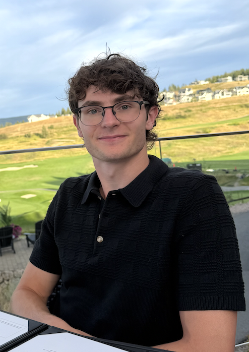

---
about:
  template: jolla
  image: images/profile.jpg
---

## Milan Bertolutti

{width=250px}

### Introduction

My name is Milan Bertolutti. I started UBC's Masters of Data Science after graduating from UBC Okanagan, where I completed my Bachelor's in Computer Science with a minor in Data Science. I chose this program because I really enjoyed my DATA courses during my minor and wanted to learn more. What I am looking for from MDS is more experience working with real-world data.

Outside of school I do freelance web development, and over the past year I have redesigned and rebuilt the portfolio websites for two different companies. Most of my experience so far has been full stack work with React, Next.js, and SQL databases, along with projects in machine learning and deep learning. When I am not at a computer you can usually find me indoor rock climbing, on the golf course, or playing basketball.
